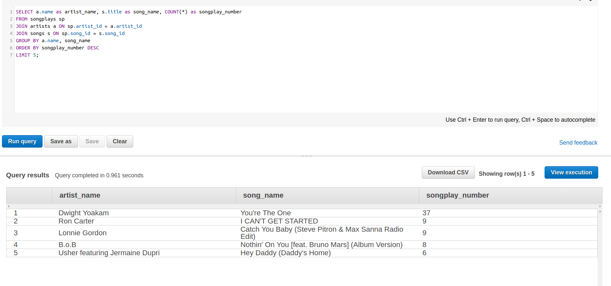

### Introduction

Sparkify, a startup company, collects user song play and song data as JSON log files via its music streaming app.  They want to understand what songs users are listening to. 

First, they want to create a cloud database at AWS Redshift.  So, analysts can have access to the database anywhere to conduct queries and analysis.  I use star schema to create tables that is optimized for joining tables and analytical queries. 

### Database Schema

There are different sql database schemas.  One common schema is star schema, in which the central "fact" table can join other "dimension" tables to aggregate informantion.  In this project, the fact table "songplays" is surrounded by "songs", "artists", "users" and "time" dimesion tables (4 tables). The following diagram shows the relationship among the tables.    

### AWS Redshift

Redshift are column-oriented database management system with parallel processing to massively speed up query and analytical processes. In addition, distkeys and sortkeys can be used to partition and sort data in organized ways to further speed up query processes.

### Steps for creating SQL database on AWS Redshift

#### A. Setup Redshift cluster 

The entire process is described in the lecture excise ('L3 Exercise 2 - IaC' jupyter notebook) that includes the following steps. 

1. Create a new IAM user in the AWS account with AdministratorAccess policies attached to it.  Record the access key and secret (do not disclose it to the public).   
2. Specifiy the cluster params for Redshift cluster configuration in the dwh.cfg file that is in the same folder as the jupyter notebook running the Redshift cluster setup. 

3. Use boto3 library to create clients for EC2, S3, IAM, and Redshift (infrastructure-as-code) in "us-west-2" region, which is in the same region as the S3 buskets containing the event_log and song data. 

4. Create IAM role allowing Redshift clusters to call AWS services on user behalf, and then attach a policy to allow Redshift to read S3 storage.  

5. Obtain IAM role ARN, put it in ARN param in the dwh.cfg file.  

6. Use params in dwh.cfg to create the cluster and database.  

7. Obtain the param for host (cluster ENDPOINT) in dwh.cfg.  

8. Open an incoming TCP port to access the host (cluster ednpoint) and connect to the cluster.  

#### A. Create tables
1. Drop all tables to have a clean start (create_tables.py). 
2. Create 5 tables with proper column names and data types (create_tables.py), also specify some columns as distkey or sortkey. 

#### B. Build ETL Processes
1. Copy song_data and log_data from S3 buckets to staging_songs and staging_events tables. 
2. Extract and transform data from staging_songs and staging_events tables with SQL SELECT statements, and insert data into different tables (etl.ipynb and sql_queries.py). 

###  Example queries and results
Once the database is created.  We can do queries on it to extract useful information through Redshift query console.  Two examples are illustrated below.   

#### 1.  What are top 5 most played songs in songplays table, including info on artist and song names?

#### How many total events in  songplays table?

#### Included files: 
1. dwh.cfg (Redshift configuration params)
2. sql_queries.py (queries for dropping/creating tables and copy/insert data into tables)
3. create_tables.py (create tables)
4. etl.py (copy and insert data into tables)
5. README.MD (description and summary of the project)
6. README.MD.ipynb (description and summary of the project) -- screenshot images are displayed properly
7. star_schema.png, Query1b.png and Query3.png (screenshots of query results). 
(Screenshots are not displayed properly with in README.MD file at workspace.  But they are displayed properly in README.md.ipynb file.)  
